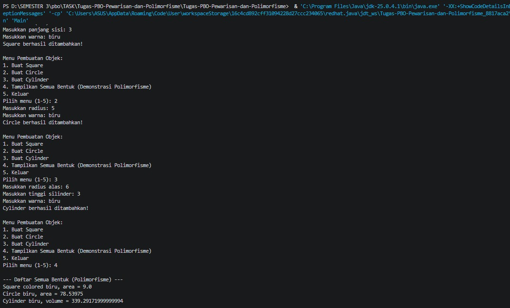

# Tugas PBO - Inheritance dan Polimorfisme (Sistem Geometri)

Repositori ini berisi implementasi tugas ke-2 mata kuliah Pemrograman Berorientasi Objek (PBO). Proyek ini difokuskan pada penerapan empat pilar utama OOP, khususnya **Pewarisan (Inheritance)** dan **Polimorfisme (Polymorphism)**, melalui simulasi bentuk-bentuk geometri. Program ini dijalankan melalui antarmuka baris perintah (CLI) yang interaktif.

## Deskripsi Kelas

1. **`Shape.java` (Superclass)**
   Kelas dasar (induk) untuk semua bentuk. Kelas ini merangkum properti umum yaitu `color` (warna) dan memiliki metode `printInfo()` yang nantinya akan di-*override* oleh kelas turunannya.

2. **`Square.java` (Subclass dari Shape)**
   Kelas ini mewarisi `Shape` dan merepresentasikan bangun datar persegi. Menambahkan atribut spesifik yaitu `side` (panjang sisi) serta metode `area()` untuk menghitung luas. Metode `printInfo()` dimodifikasi (*override*) untuk menampilkan informasi persegi beserta luasnya.

3. **`Circle.java` (Subclass dari Shape)**
   Kelas ini mewarisi `Shape` dan merepresentasikan bangun datar lingkaran. Menambahkan konstanta `PI`, atribut `radius` (jari-jari), serta metode `area()`. 

4. **`Cylinder.java` (Subclass dari Circle)**
   Kelas ini mendemonstrasikan **Multilevel Inheritance** dengan mewarisi kelas `Circle`. Kelas ini merepresentasikan bangun ruang silinder dengan menambahkan atribut `height` (tinggi). Karena mewarisi `Circle`, kelas ini dapat menggunakan metode `area()` milik lingkaran sebagai luas alas untuk menghitung `volume()`.

5. **`Main.java` (Driver Class)**
   Kelas utama yang menjalankan program dengan menu CLI interaktif (menggunakan `Scanner`). Kelas ini menggunakan struktur data `ArrayList<Shape>` untuk menyimpan semua objek (Persegi, Lingkaran, Silinder) ke dalam satu wadah yang sama.

---

## Penerapan Konsep Polimorfisme
Program ini menunjukkan polimorfisme (*Run-time Polymorphism / Dynamic Method Dispatch*) di dalam kelas `Main`. 
Meskipun array list dideklarasikan dengan tipe induk (`ArrayList<Shape>`), ia dapat menampung objek `Square`, `Circle`, dan `Cylinder`. Ketika menu nomor 4 dipilih, program akan memanggil metode `printInfo()` dari referensi `Shape`. Java secara dinamis akan mengeksekusi metode `printInfo()` yang sesuai dengan bentuk asli objek tersebut pada saat program berjalan.

---

## Hasil Eksekusi Program (Output)

### Penjelasan Alur Menu:
1. **Membuat Objek Square (Menu 1):** Pengguna terlebih dahulu memilih menu 1 (pesan menunya sudah tergeser ke atas pada gambar), kemudian memasukkan panjang sisi **3** dan warna **biru**. Objek `Square` berhasil dibuat.
2. **Membuat Objek Circle (Menu 2):** Pengguna memilih menu 2, lalu memasukkan radius **5** dan warna **biru**. Objek `Circle` berhasil ditambahkan ke dalam list.
3. **Membuat Objek Cylinder (Menu 3):** Pengguna memilih menu 3, lalu memasukkan radius alas **6**, tinggi silinder **3**, dan warna **biru**. Objek `Cylinder` berhasil ditambahkan.
4. **Demonstrasi Polimorfisme (Menu 4):** Pengguna memilih menu 4 untuk mencetak semua bentuk yang telah dibuat. Program menampilkan:
   * `Square colored biru, area = 9.0` (Luas persegi dihitung dari 3 x 3).
   * `Circle biru, area = 78.53975` (Luas lingkaran dihitung dari PI x 5²).
   * `Cylinder biru, volume = 339.29171999999994` (Volume silinder dihitung dari luas alas x tinggi, yaitu [PI x 6²] x 3).
   
   **Kesimpulan:** Meskipun ketiga bentuk tersebut dipanggil secara serentak menggunakan metode `printInfo()` dari wadah/tipe data induk yang sama (`Shape`), format teks dan perhitungan nilainya keluar berbeda-beda sesuai dengan wujud aslinya. Inilah wujud nyata dari konsep **Polimorfisme**.